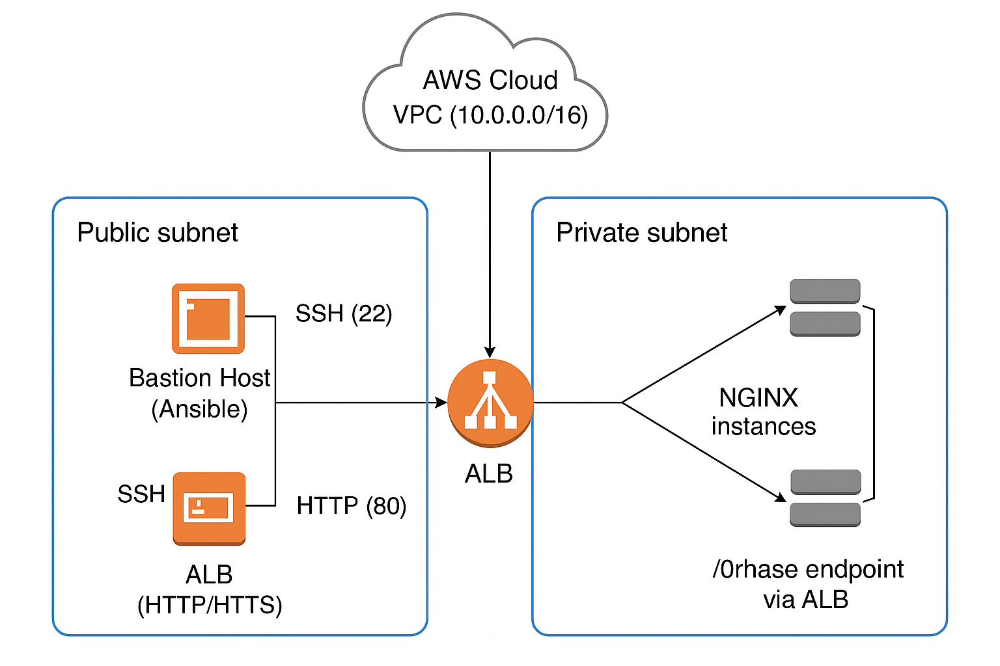

# Terraform + Ansible Infrastructure Automation Assignment

## Architecture Topology

## Overview
This project demonstrates a **fully automated AWS infrastructure** deployed with **Terraform**, configured via **Ansible**, and orchestrated by **GitHub Actions**.

It builds a complete environment consisting of:
- an Ansible public instance
- three private NGINX servers without access to the internet, placed behind the ALB
- an Application Load Balancer (ALB)  
- secure VPC, state management, and automation pipeline
- Key Pair Generated by Terraform to Access all those EC2 instances

## Modules Structure
- `VPC` - Creates VPC, public + private subnets (no NAT) 
- `Security_Group`- SSH, ALB and NGINX security rules 
- `KP` - Creates key pair `ubuntu_KP.pem`
- EC2-instance` - Deploys Ansible bastion and 3 NGINX instances
- `ALB` - Creates Application Load Balancer + Target Group |
- Backend - S3 + DynamoDB for state and lock 

## GitHub Actions Pipeline
- Located at: `.github/workflows/deploy_infrastructure.yml`

### Trigger of the pipeline
- On pull request → `terraform plan` will display what will be deployed
- On push to `main` → terraform apply + Ansible actions

### Steps Summary
- Checkout repository 
- Configure AWS credentials 
- Installs Ansible on github runner
- Terraform Init / Validate / Plan / Apply
- Copy SSH key to  Ansible instance (`/home/ubuntu/`) 
- Upload git ansible config `ansible/` directory to Ansible instance 
- Generate `inventory.ini` from Terraform outputs and copy it to Ansible instance
- Run Ansible playbook on the ansible instance

## Ansible Configuration
### Playbook Summary
- File: `ansible/playbook.yml`
Contaning:
- hosts: nginx (group of instances)
  become: yes
  roles:
    - nginx
    - ssl

### Role Nginx 
- Role nginx installs and configures web servers
- Installs NGINX
- Creates /phrase endpoint
- Enables HTTP (80) and HTTPS (443)
- Ensures service starts on boot

### Role SSL
- Generates self-signed SSL certificate
- Restarts nginx service to apply the self-signed SSL certificate

### Dynamic invenotry.ini
- pre-configured inventory.ini contains 3 IP addresses
- pipeline job Generate and replace inventory.ini in the downloaded ansible folder on the ansible instance will replace them in place and store them on ansible instance
- [nginx]
    10.0.1.35
    10.0.1.199
    10.0.1.207

## Requirements

| Name | Version |
|------|---------|
|  [aws](#requirement\_aws) | ~> 5.0 |

## Providers

No providers.

## Modules

| Name | Source | Version |
|------|--------|---------|
|  [ALB](#module\_ALB) | ./modules/ALB | n/a |
|  [EC2-instance](#module\_EC2-instance) | ./modules/EC2-instance | n/a |
|  [KP](#module\_KP) | ./modules/KP | n/a |
|  [Security\_Group](#module\_Security\_Group) | ./modules/Security_Group | n/a |
|  [VPC](#module\_VPC) | ./modules/VPC | n/a |

## Resources

No resources.

## Inputs

| Name | Description | Type | Default | Required |
|------|-------------|------|---------|:--------:|
|  [aws\_region](#input\_aws\_region) | AWS region to deploy the resources into | `string` | n/a | yes |
|  [instance\_key\_name](#input\_instance\_key\_name) | Name of the instance key pair | `string` | n/a | yes |
|  [instance\_name](#input\_instance\_name) | Name of the AWS instance | `string` | n/a | yes |
|  [public\_ip](#input\_public\_ip) | Your public IP to be able to access the EC2 instance | `string` | n/a | yes |
|  [vpc\_name](#input\_vpc\_name) | VPC | `string` | n/a | yes |

## Outputs

| Name | Description |
|------|-------------|
|  [ALB\_SG\_id](#output\_ALB\_SG\_id) | n/a |
|  [Alb\_SG\_name](#output\_Alb\_SG\_name) | ALB HTTPS SG outputs |
|  [Nginx\_SG\_id](#output\_Nginx\_SG\_id) | n/a |
|  [Nginx\_SG\_name](#output\_Nginx\_SG\_name) | n/a |
|  [SSH\_SG\_id](#output\_SSH\_SG\_id) | n/a |
|  [SSH\_SG\_name](#output\_SSH\_SG\_name) | Security groups |
|  [alb\_dns\_name](#output\_alb\_dns\_name) | ALB outputs |
|  [ansible\_instance\_public\_ip](#output\_ansible\_instance\_public\_ip) | n/a |
|  [nginx\_private\_ips](#output\_nginx\_private\_ips) | n/a |
|  [private\_key\_name](#output\_private\_key\_name) | KP outputs |
